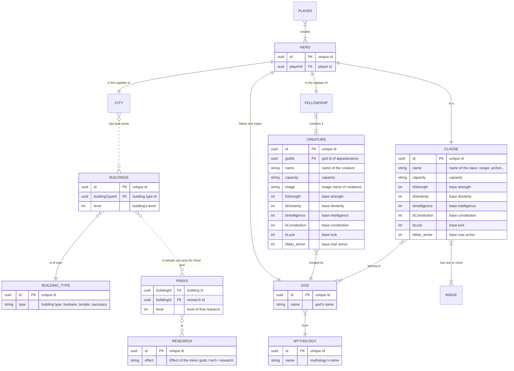

```mermaid
erDiagram
    PLAYER }|--|{ HERO : creates
    HERO {
        uuid id PK "unique id"
        uuid playerId FK "player id"
    }
    
    HERO ||--|| CITY : "is the capitain of"
    CITY }o..o{BUILDINGS : "has built some"
    BUILDINGS {
        uuid id PK "unique id"
        uuid buildingTypeId FK "building type id"
        int level "building's level"
    }
    BUILDINGS }o--||BUILDING_TYPE : "is of type"
    BUILDING_TYPE {
        uuid id PK "unique id"
        string type "building type: bestiaire, temple, sanctuary"
    }
    
    BUILDINGS }o..o{ PRAYS : "in temple can pray for minor god"
    PRAYS {
        uuid buildingId FK "building id"
        uuid buildingId FK "research id"
        int level "level of that research"
    }
    PRAYS }o..o{ RESEARCH: "is"
    RESEARCH {
        uuid id PK "unique id"
        string effect "Effect of the minor gods / tech / research"
    }
    
    HERO ||--|| FELLOWSHIP : "is the capitain of"
    FELLOWSHIP }|--|{ CREATURE : "contains 4"
    
    HERO ||--|| GOD : "follow one major"
    GOD{
        uuid id PK "unique id"
        string name "god's name"
    }
    GOD}|--||MYTHOLOGY: "from"
    MYTHOLOGY{
        uuid id PK "unique id"
        string name "mythology's name"
    }
    GOD {
        
    }
    
    HERO ||--|| CLASSE : "is a"
    CLASSE{
        uuid id PK "unique id"
        string name "name of the class: ranger, archer..."
        string capacity "capacity"
        int bStrength "base strength"
        int bDexterity "base dexterity"
        int bIntelligence "base intelligence"
        int bConstitution "base constitution"
        int bLuck "base luck"
        int bMax_armor "base max armor"
    }
    CLASSE }|--|{ IMAGE : "has one or more"
    IMAGE {
    
    }
    CREATURE }|--|| GOD : "created by"
    CREATURE {
        uuid id PK "unique id"
        uuid godId FK "god id of appartenance"
        string name "name of the creature"
        string capacity "capacity"
        string image "image name of createure"
        int bStrength "base strength"
        int bDexterity "base dexterity"
        int bIntelligence "base intelligence"
        int bConstitution "base constitution"
        int bLuck "base luck"
        int bMax_armor "base max armor"
    }
    CLASSE }|--|{ GOD : "belong to"
    
        
```