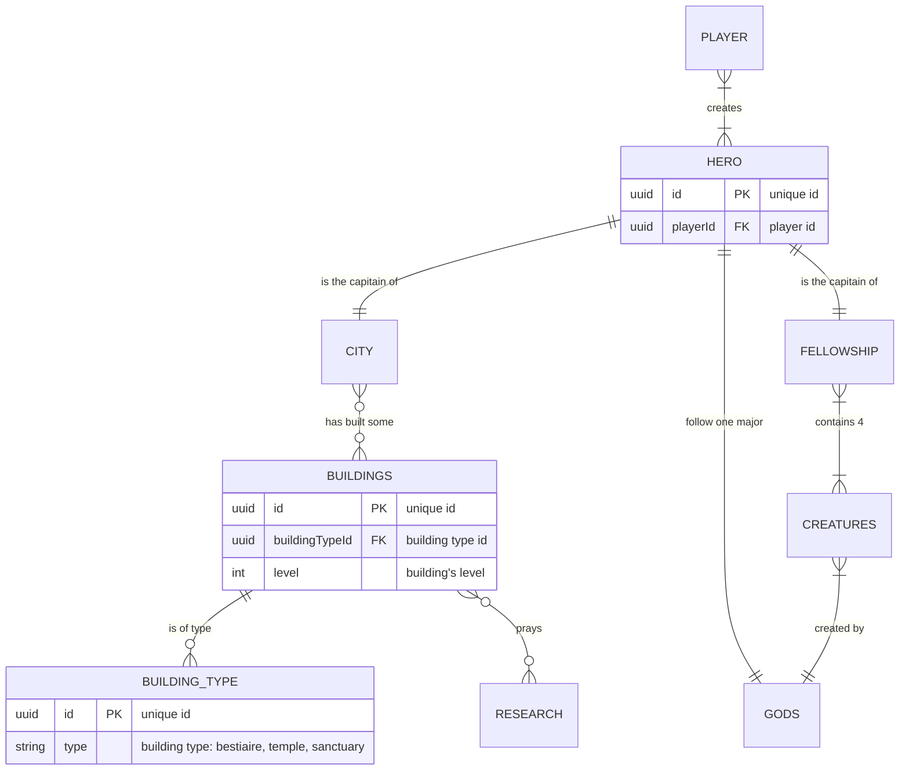

```mermaid
erDiagram
    PLAYER }|--|{ HERO : creates
    HERO {
        uuid id PK "unique id"
        uuid playerId FK "player id"
    }
    
    HERO ||--|| CITY : "is the capitain of"
    CITY }o--o{BUILDINGS : "has built some"
    BUILDINGS {
        uuid id PK "unique id"
        uuid buildingTypeId FK "building type id"
        int level "building's level"
    }
    BUILDINGS ||--o{BUILDING_TYPE : "is of type"
    BUILDING_TYPE {
        uuid id PK "unique id"
        string type "building type: bestiaire, temple, sanctuary"
    }
    
    BUILDINGS }o--o{ RESEARCH : prays
    
    HERO ||--|| FELLOWSHIP : "is the capitain of"
    FELLOWSHIP }|--|{ CREATURES : "contains 4"
    
    HERO ||--|| GODS : "follow one major"
    CREATURES }|--|| GODS : "created by"
        
```